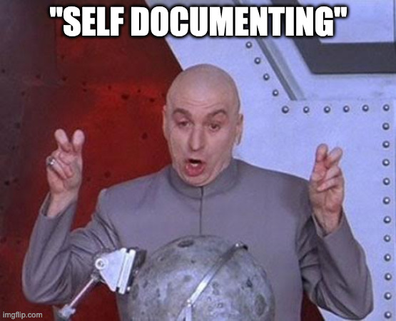
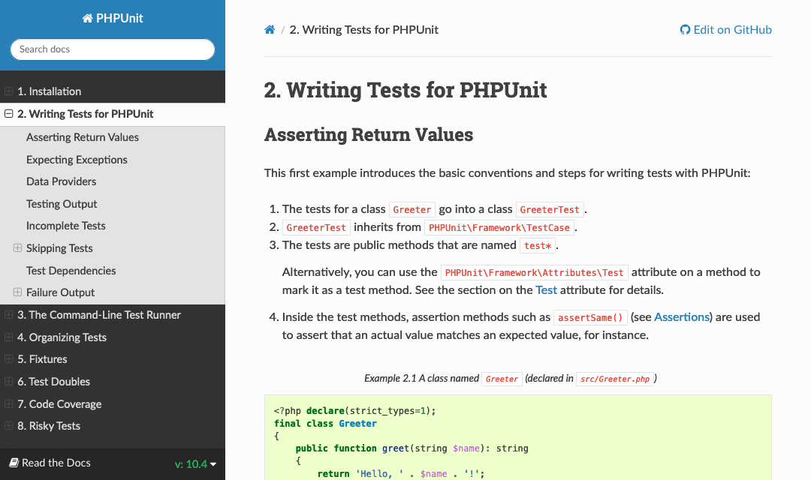
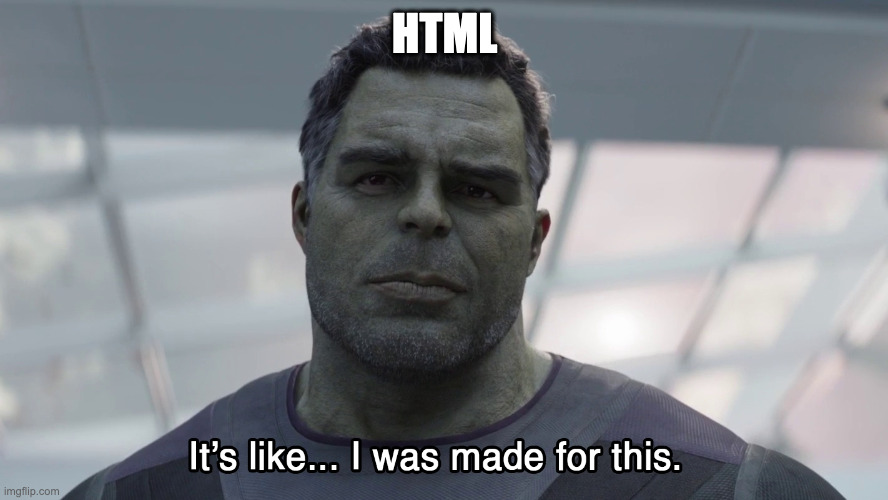

<!-- .slide: class="dark-bg title-slide" data-background-image="resources/coke-darken.jpg" data-background-position="center center" data-background-size="cover" data-hide-footer -->
# I'd Like to Write the World Some Docs

Steve Grunwell <!-- .element: class="byline" -->
[@stevegrunwell@phpc.social](https://phpc.social/@stevegrunwell)
[stevegrunwell.com/slides/write-some-docs](https://stevegrunwell.com/slides/write-some-docs)

---

## What is<br>Documentation?

Note:

In order to write great documentation, we need to first define what we intend to write.

Technical documentation can be a broad topic, so for the sake of narrowing the scope we'll group documentation into two groups: inline and external documentation.

----

### Inline Documentation

* Documentation within the code itself, written for a developer audience <!-- .element: class="fragment" -->
* Describes what everything does, function inputs/outputs, contextual information, etc. <!-- .element: class="fragment" -->

Note:

* Inline documentation is the code we write in the codebase itself
* Where we describe what arguments are accepted by a function, how something works, and anything people need to know in order to integrate with our code.

----

### Inline Documentation

```php
/**
 * Validate an email address.
 *
 * @param string $email The email address to validate.
 *
 * @return bool True if the email is valid, false otherwise.
 */
function validateEmail(string $email): bool
{
    return filter_var($email, FILTER_VALIDATE_EMAIL);
}
```

Note:

* Typical example of a DocBlock for a PHP function (more on this later)
* Summarize what the method does, what arguments it takes, what it returns, and what that return value means

----

### Inline Documentation

```php
/**
 * Definition for the Person class.
 *
 * @package MyPackage
 * @author  ACME, Inc.
 * @license MIT
 */

namespace ACME\MyPackage;

class Person
{
    // ...
}
```

Note:

* Can also create file or class-level docblocks to help provide context
* What package does it belong to? Who wrote it? What's the license?

----

### Inline Documentation

```php
/*
 * I have no idea what this bit of code does,
 * and the person who wrote it retired and is
 * now raising goats or something.
 *
 * Please please please be careful!
 */
```

Note:

Sometimes, inline documentation is less formal. Sometimes it's an explanation why something was done a certain way, a warning, or an apology.

----

### External Documentation

* <!-- .element: class="fragment" --> Public-facing documentation
	* User guides
	* API documentation
* <!-- .element: class="fragment" --> Internal documentation
	* README files
	* Wikis, Confluence, et al

Note:

When the documentation isn't intermingled with the code — even if it co-exists in the repository — we refer to it as "external" documentation.

* External documentation can take multiple forms:
    * Tutorials + user guides to help people use your product
    * API documentation to help developers integrate with your service.
* Doesn't need to be public at all
    * README file in the repo
    * Internal wiki

No matter where it lives, external documentation contains important pieces of information

---

## Why Do We Write Documentation?

Note:

Now that we understand the "What" of documentation, let's take a look at the "Why".

----

### We Document For Others

The greatest software is that which can be used

Note:

* Obvious answer, but worth reiterating
    * Our job is to write software that people can use, and that means making the barrier of entry as low as possible.
* Whether end users or teammates, documentation exists to make other peoples' lives easier.

----

### We Document For Ourselves

* Help us remember how and why something works <!-- .element: class="fragment" -->
* Catch issues with our approach before writing any code <!-- .element: class="fragment" -->
* Strengthen our own writing skills <!-- .element: class="fragment" -->
* Better documentation → fewer questions <!-- .element: class="fragment" -->


Note:

Of course, this doesn't mean we can't benefit ourselves from having good documentation.

* Documentation helps us remember how or why something works the way it does
    * You six months from now will likely be in a very different headspace than you today
* Writing documentation as we write forces us to think through our implementations
* Improves our own writing abilities
* It also can't be understated how many questions good documentation can deflect.
    * Fewer questions means less context switching.

----

### RTFM!

Read The F'ing Manual <!-- .element: class="fragment"-->

Note:

Generally speaking, I'd recommend against using this exact phrase. However, it's hard to tell someone to "RTFM" if there's no "FM" for them to "R".

* Well-written documentation is your first line of defense against answering the same questions over and over again
    * You don't get to complain about people distracting you with questions all the time if you haven't given them a better channel

----

> Documentation is a love letter that you write to your future self. <footer>—Damian Conway</footer>

Note:

* Damian Conway, Aussie member of the Perl community.
* It was once pointed out to me that bad documentation can also be hate-mail from previous developers, though in my experience that usually comes in the form of terrible architecture and an absence of tests

---

## Writing Inline Documentation

Note:

* Covered the what and why, so let's talk about how to write documentation.
* Will start with inline docs

----

### Meet the Docblock

* Specially-formatted comment <!-- .element: class="fragment" -->
    * Will vary across languages
* Document files, functions, methods,<br>variables, and more <!-- .element: class="fragment" -->
* Parsed by IDEs & static code analysis <!-- .element: class="fragment" -->

Note:

* Each programming language has its own terminology, but generally speaking there's some concept of a "docblock", which is a specially-formatted comment.
* These can generally exist at the file-level or be for specific functions, methods, variables, etc.
* In addition to helping developers understand how the code works, this documentation is also consumed by IDEs (Intellisense), static code analysis tools like PHPStan, Phan, et al, and more

----

### PHPDoc

```php
/**
 * Add two numbers and return the absolute value.
 *
 * @param int $a The first number.
 * @param int $b The second number.
 *
 * @return int The absolute value of $a + $b.
 */
function absum(int $a, int $b): int
{
	return abs($a + $b);
}
```

Note:

While there isn't an official format, PHPDoc is the most common form you'll see in the PHP ecosystem.

There is a draft PSR (PSR-5) to adopt PHPDoc as the official format, but efforts seem to have stalled.

We'll take a closer look at the structure of PHPDoc in a minute.

----

### JSDoc

```js
/**
 * Add two numbers and return the absolute value.
 *
 * @param {number} a The first number.
 * @param {number} b The second number.
 *
 * @return {number} The absolute value of a + b.
 */
function absum(a, b)
{
	return Math.abs($a + $b);
}
```

Note:

Very similar to PHPDoc, but uses curly-braces around the types.

----

### Javadoc

```java
import java.lang.Math;

/**
 * Add two numbers and return the absolute value.
 *
 * @param int a The first number.
 * @param int b The second number.
 *
 * @return The absolute value of a + b.
 */
int absum(int a, int b)
{
	return Math.abs(a + b);
}
```

Note:

To give you a sense of how common this pattern can be, here's the same code using the Javadoc standard.

----

### Docblock comments

* <!-- .element: class="fragment" --> Docblocks begin with <code>/**</code> and end with <code>*/</code>
* <!-- .element: class="fragment" --> Can be single or multi-line
    ```php
    /**
     * This is a docblock.
     */

    /** So is this. */
    ```

Note:

* In PHP, Docblocks begin with /** and end with */
* These can be on one line or on multiple, as long as it has those opening and closing elements

----

### Not all comments are docblocks!

```php
# This isn't a docblock.

// Neither is this.

/*
 * Close, but this only has one asterisk at the opening.
 */
```

Note:

It's important to understand that not all PHP comments will be parsed as docblocks, only those that start with a slash and two asterisks.

----

### Anatomy of a Docblock

<pre class="fragment-replace"><code class="fragment hljs php fade-out" data-fragment-index="0">/**
 *
 *
 *
 *
 *
 *
 */</code><code class="fragment hljs php" data-fragment-index="0">/**
 * This is the summary.
 *
 *
 *
 *
 *
 */</code><code class="fragment hljs php" data-fragment-index="1">/**
 * This is the summary.
 *
 * This is the description. We can get a little more
 * in-depth here.
 *
 *
 */</code><code class="fragment hljs php" data-fragment-index="2">/**
 * This is the summary.
 *
 * This is the description. We can get a little more
 * in-depth here.
 *
 * @return string This is an example of a tag.
 */</code>
</pre>

Note:

Regardless of the language, docblocks generally follow this pattern:

1. Summary (one-line to explain what the function does)
2. Description (details about the implementation, optional)
3. Tags (special information about the code)

Now we'll look at some of the most common tags you'll come across:

----

### `@param`

`<type> <name> [<description>]`

```php
/**
 * @param string  $name    The customer's name.
 * @param Address $address The customer's address.
 */
function saveAddress(string $name, Address $address)
{
    // ...
}
```

Note:

Describes a function or method argument

----

### `@return`

`<type> [<description>]`

```php
/**
 * Retrieve the currently logged-in user.
 *
 * @return User The current User instance.
 */
public function getCurrentUser(): User
{
    // ...
}
```

Note:

Documents the return type of the function or method.

Note that it follows the same format as @param except that it doesn't include the variable name.

----

### `@var`

`<type> <name> [<description>]`

```php
/**
 * @var string $name The customer's name.
 */
protected string $name;
```

Note:

The @var tag takes the same shape as @param, but is used for documenting variables and class properties.

----

### `@throws`

`<type> [<description>]`

```php
/**
 * @throws InvalidUserException If no user with the given ID
 *                              can be found.
 */
public function getUserById(int $id): User
{
    // ...
}
```

Note:

If the code you're writing can throw exceptions, it's great to identify which types of exceptions are thrown under different conditions.

----

### Intersection & Union Types

Used to further narrow types.

```php
/**
 * @param Corn&Popable $kernels The kernels must be corn and
 *                              pop-able.
 * @param Butter|Oil   $fat     Popcorn can be made with
 *                              either butter or oil.
 */
function makePopcorn(Corn&Popable $kernels, Butter|Oil $fat)
{
    // ...
}
```

Note:

* Intersection types: value satisfies two or more types
    * Intersection types are represented with an ampersand: our $kernels argument must be an instance of Corn *and* implement the Popable interface.
* Union types: value satisfies at least one of the given types
    * Union types are separated with a vertical pipe, meaning that $fat can accept an instance of Butter _or_ Oil.

----

### Nullable Types

```php
/**
 * @param int|null $id         The user ID. If $id is null,
 *                             default to the current user.
 * @param ?string  $connection The connection identifier.
 *
 * @return ?User The corresponding user, or null if no user
 *               was found.
 */
function getUser(
    ?int $id = null,
    ?string $connection = null
): ?User {
    // ...
}
```

Note:

If you have nullable arguments (or a nullable return value), you can either use "null" as a candidate in a union type or prefix the type with a question mark; these two are equivalent.

----

### Taco Break!

 <!-- .element: style="max-height: 45vh; width: auto;"-->

Note:

While I was rehearsing this talk, I was like "whoa, this is dense. I wish there was a picture of a cat or something"

Anyway, Taco is cheering you on. We're half-way through inline documentation!

----

### Array Shapes

<pre class="fragment-replace"><code class="fragment hljs php fade-out" data-fragment-index="0">/**
 * @var array
 */
private array $address;</code><span class="fragment fade-out" data-fragment-index="1"><code class="fragment hljs php" data-fragment-index="0">/**
 * @var array&lt;string, mixed>
 */
private array $address;</code></span><code class="fragment hljs php" data-fragment-index="1">/**
 * @var array{
 *      street_address:string,
 *      street_address2?:string,
 *      city:string,
 *      state:string,
 *      postal_code:string,
 *      country:string
 *  }
 */
private array $address;</code></pre>

Note:

Array shapes can be extremely helpful, especially if you're working in a codebase where associative arrays are being used everywhere instead of value objects.

----

### Dynamic Properties

```php
/**
 * @property      string $name The animal's name.
 * @property-read int    $age  The animal's age in years.
 */
class Animal
{
    private array $props = [];

    public function __get($prop)
    {
        return $this->props[$prop] ?? null;
    }
}
```

Note:

* If you rely on magic properties via the __get() magic method, you may document these properties with @property, @property-read, and @property-write
* @property indicates read/write access
* @property-read and @property-write imply read- or write-only, respectively

----

### Linking to Relevant Content

```php
/**
 * We can also suggest that people {@see some_function()}
 * within our docs.
 *
 * @see some_other_function() For an example implementation.
 *
 * @link https://example.com/some-link
 */
```

Note:

Two ways to link to other content:

1. @see is generally used to point to other parts of the codebase, but can technically support URLs
2. @link is used for absolute URLs, like external sites, GitHub READMEs, etc.

----

### `@todo`

`<description>`

```php
/**
 * @todo (stevegrunwell) Finish implementing this!
 * @todo https://jira.example.com/browse/APP-123
 */
```

Note:

The @todo tag lets developers flag pieces of code that still need to be worked on.

While the tag technically accepts any description, it's strongly recommended to link to a relevant ticket if one exists: not only does this give future-you more context, but makes it easier to see if the comment is out-of-date.

---

## Leveling Up Your Inline Documentation

Note:

At this point, we've covered the basic semantics for inline documentation. Now let's talk about how to make yours stand out among the rest.

----

### What, How, and Why?

Good documentation will explain not only **what** something does, but **how** and **why**.

Note:

When you're writing inline documentation, you're generally writing for a developer audience. As developers, we often want to know three things:

1. What does it do?
2. How do I use it?
3. Why does it work the way it does?

At the very least, this generally means you'll want to document all function and method arguments, return types, any globals that are in-play, and side-effects of different functions.

----

### Documentation should be useful!

<pre class="fragment-replace"><code class="fragment fade-out hljs php" data-fragment-index="0">/**
 * Handle Ajax requests for user profile data.
 *
 * The $_POST['fields'] key, if set, will contain a
 * comma-separated list of keys to retrieve. If left
 * empty, all keys will be returned.
 *
 * @return array An associative array of profile fields,
 *               optionally filtered by $_POST['fields'].
 */</code><code class="fragment hljs php" data-fragment-index="0">// Ajax stuff</code></pre>

Note:

We're not writing documentation for our health, it should have a purpose.

* This version gives us context as to what's happening in the function
* Whereas this version tells us nothing

----

### "But my code is<br>self-documenting!"



Note:

Be wary anytime someone claims that they don't need to write documentation because their code is "self-documenting".

No matter how strict your types and well-named your methods, any non-trivial codebase will have some areas where additional context would be helpful. You don't need to be duplicative, but err on the side of more documentation than less.

A good smell test: could someone who doesn't write PHP but understands JavaScript follow your code without getting lost? The two languages have a lot of commonalities, but are still distinct languages with their own idiosyncracies. Plus, as a PHP developer there's a good chance you're having to interface with some JS folks.

Remember: having documentation isn't a weakness nor point of shame, so don't let anyone shame you into thinking otherwise.

----

### Be Aware of Project Standards


Note:

* PHPDoc is pretty common, but different projects may have different conventions for things like alignment, phrasing, or the handling of certain tags.
    * Example: WordPress asks that you *not* use `@return void` - no return, omit the tag
* Knowing the conventions used by your project will make reading and contributing to documentation far less painful.

----

### Generating API Docs

* Well-formed inline docs can be compiled to create nicely-formatted documentation <!-- .element: class="fragment" -->
* <!-- .element: class="fragment" --> Great for internal teams, <em>fantastic</em> for open-source projects
* A perfect use for your CI pipeline <!-- .element: class="fragment" -->
* Examples: <!-- .element: class="fragment" -->
	* [WordPress Code Reference](https://developer.wordpress.org/reference/)
	* [Laravel API docs](https://laravel.com/api/9.x/)

Note:

One of the big advantages to using common documentation practices is the ability to generate documentation in different forms.

* HTML, PDFs, and even ebook formats
* Makes your documentation available to be searched without opening an IDE
* Generating docs is scripted, so it fits nicely into a CI/CD workflow
* Some examples in the wild:
    * The WordPress Codex is mostly generated from inline documentation, giving you a nice view of arguments, return values, filters, the source itself, where the code lives, and anything that calls it or relies up it for every function
    * The Laravel API docs are generated from the source code using Doctum

----

### Tools for Generating API Docs

* [phpDocumentor](https://www.phpdoc.org) ([example](./composer-docs/phpdocumentor/index.html))
* [ApiGen](https://github.com/ApiGen/ApiGen) ([example](./composer-docs/apigen/index.html))
* [Doctum](https://github.com/code-lts/doctum) ([example](./composer-docs/doctum/index.html))

Note:

* Number of great documentation generators out there, but here are some of the most popular in the PHP ecosystem (I've almost certainly missed someone's favorite)
* Examples, each generated from the same commit of Composer using phars of each tool
* Each tool has its own configurations, letting you apply themes, specify what is (or is not) included, and more.

----

### Generate Docs Often

* Identify gaps <!-- .element: class="fragment" -->
* Detect duplication or spaghetti code <!-- .element: class="fragment" -->

Note:

Even if your codebase isn't being distributed, regularly generating documentation can have some benefits:

Generated docs will help highlight areas of the codebase that don't have documentation and could benefit from more attention. Several of the tools include reports for areas that are either missing or don't have sufficient coverage.

Getting a high-level view of your app can also help you recognize possible code organization issues and find things like duplicated functionality or features you had forgotten about.

---

## External Documentation

Note:

Now that we've covered inline documentation, let's talk about all of the stuff that's outside of the codebase.

----

### Where do I start?

<pre class="fragment fragment-replace" data-fragment-index="0"><code class="fragment fade-out hljs md" data-fragment-index="1"># My Neat Project

* What does it do?
* Getting started
    * Installation
        * Composer
        * Phar
    * Initial setup
* ...</code><code class="fragment hljs md" data-fragment-index="1"># My Neat Project

## What does it do?

## Getting started

### Installation

#### Composer

#### Phar

### Initial setup</code></pre>

Note:

It's easy to say "go write documentation". It's much harder to define _what_ to document, and starting from scratch can be overwhelming

* Start with a rough outline of what you want to get across, using nested headings
    * What does this app do?
    * How do I install it? What are the system requirements?
    * How do I run it? What options are available?
    * FAQs, contribution guidelines, and anything else that might be relevant
* As you fill out the sections, don't be afraid to add new ones
* Just like with code, it's okay to mark things as `@todo`

----

### Where should it live?

* In the repository (docs/) <!-- .element: class="fragment" -->
* Internal site (Confluence, intranet, etc.)  <!-- .element: class="fragment" -->
* External site (website, GitHub Pages, etc.)  <!-- .element: class="fragment" -->
* Third-party platform (Read The Docs, et al)  <!-- .element: class="fragment" -->
* <!-- .element: class="fragment" --> <strong>Not</strong> in Discord, Slack, etc.

Note:

When we're writing documentation that isn't necessarily part of our code, we have to decide where to put it.

* The easiest solution is often in the repository itself, in a docs/ directory (or similar).
* If the documentation is only for your company, you might house it in something like Confluence or another similar internal documentation platform.
* Meanwhile, public documentation could live on your site, on a separate website (docs.example.com)...
* ...or even on a third-party platform like Read The Docs.
* No matter where it ends up, it should be some place that is searchable and persistent. Don't write up a couple posts in Slack or Discord and expect people to be able to find id.

----

### Build & Host Documentation

* [Read The Docs](https://readthedocs.com)
* [ReadMe](http://readme.io/)
* [Daux.io](https://daux.io/)
* [Sphinx](https://www.sphinx-doc.org/en/master/)
* [GitHub Pages](https://pages.github.com/)

Note:

Depending on your needs, there's a variety of places to publicly host your documentation.

If at all possible, I'd encourage you to host on a subdomain of your company or project's site (e.g. docs.example.com), but alternatives exist (especially if you don't want to maintain a domain for your work)

----

<!-- .slides: data-background-image="resources/read-the-docs.png" data-background-size="cover" -->
### Read The Docs <!-- .element: class="screen-reader-text" -->

[](https://docs.phpunit.de/en/10.4/writing-tests-for-phpunit.html)

[docs.phpunit.de](https://docs.phpunit.de)
<!-- .element: class="image-caption"-->

Note:

We won't go clicking around, but here's a screenshot of the PHPUnit documentation just to give you a taste.

----

### How should I format it?

* Headings (H1–H6) <!-- .element: class="fragment" -->
* Ordered v unordered lists <!-- .element: class="fragment" -->
* Definition lists <!-- .element: class="fragment" -->
* Tables (for tabular data) <!-- .element: class="fragment" -->
* Code blocks, blockquotes, etc. <!-- .element: class="fragment" -->

----

### Embrace HTML <!-- .element: class="screen-reader-text" -->



Note:

* Whether you're writing documentation in Markdown, reStructuredText, Wikitext, or even just plain old HTML, chances are this is eventually going to be viewed in a browser.
* Remember that HTML is all about formatting a hierarchy of information
* Take advantage of anchors, hyperlinks, etc. to make it easy to navigate
* Documentation can be spread across multiple pages as long as it's still discoverable

----

### Markdown

```md
## This will become a <h2>

Here's a paragraph of text. This is **bold**.

* This is a list
* With multiple points
    * This one even has a sub-point!

[Here's a link](https://example.com) to learn more.
```

Note:

* Markup language that's meant to be easy to read and write, which has become pretty ubiquitous
* Many different implementations (CommonMark, GFM, Markdown Extra, etc.)

----

### reStructuredText <!-- .element: style="text-transform: none;" -->

```rst
This will become a <h2>
=======================

Here's a paragraph of text. This is **bold**.

* This is a list
* With multiple points
    * This one even has a sub-point!

`Here's a link<https://example.com>`_ to learn more.
```

Note:

* reStructuredText is similar, but comes out of the Python community
* However, it's also picking up more converts, including the Linux kernel
* When paired with a tool like Sphinx, it can build complex documentation across multiple formats
* Support for custom directives (think: macros)
* Notable PHP ecosystem users include PHPUnit and Symfony

----

### (HTTP) API Docs

* [OpenAPI (née Swagger)](https://www.openapis.org/)
* [RAML](https://raml.org/)
* [API Blueprint](https://apiblueprint.org/)

Note:

We discussed API docs a moment ago, but in the context of how the individual classes and methods of your application work.

There's another form of API documentation, and that's around any sort of publicly-exposed HTTP APIs (REST, RPC, etc.).

Documenting HTTP APIs is a topic in itself, but all of the principles are the same: we want to make sure that we're providing our consumers with detailed, accurate, and useful information about our application and how it works. Relying on established specifications also gives you a lot of great tooling that lets you generate HTTP requests right from the docs.

OpenAPI is the most widely-used specification these days, but there are also alternatives including the RESTful API Modeling Language (RAML) and API Blueprint. They all have their strengths and weaknesses, but unless you have very specific needs not met by OpenAPI, I'd start there.

---

## Improving External Documentation

Note:

For a lot of people, external documentation is where it gets scary. Where do you start?

----

### Include a Table of Contents

Let users jump to the sections that interest them.

Note:

* Many platforms will generate this for you automatically, using the document outline
* Even if you have to maintain this manually, it's extremely useful for readers

----

### Detail Prerequisite Knowledge

* People don't usually read docs cover-to-cover <!-- .element: class="fragment" -->
* If this section builds on a previous topic,<br>let the reader know! <!-- .element: class="fragment" -->

Note:

* It's unreasonable to assume that everyone will read your documentation from start to finish
    * Usually searching for a specific error code or how to do a specific thing
* If someone needs to understand (for example) your plugin system before they can understand some add-on, add something to the effect of "This feature utilizes our plugin system, which is detailed over here."
    * You can also give a brief refresher on a past topic, then link back to it

---

## General Tips

Note:

Now that you have a sense of the tools and standards out there, I'd like to share a few tips on writing the best documentation you can.

----

### When should I write my documentation?

* As (or even before!) you write your code <!-- .element: class="fragment" -->
* When questions are raised or bugs found <!-- .element: class="fragment" -->
* Whenever documentation is insufficient <!-- .element: class="fragment" -->

Note:

* Ideally, documentation should be written before you write any code. This forces you to think about your approach, and sometimes saying it out loud (or typing it) can help you catch logical errors.
* Then, if bugs or stress-cases are found, make sure these are documented! Learn from these mistakes!
* If you find yourself having to read the code to figure out what a function does, that's a sign that the documentation isn't doing it's job. Take what you've learned and write it down!

----

### Preventing "Doc-rot"

* Code changes should always include relevant changes to documentation <!-- .element: class="fragment" -->
* Protects documentation from falling behind <!-- .element: class="fragment" -->
* Forces team to write docs for new features <!-- .element: class="fragment" -->

Note:

Out-of-date documentation can be as bad or worse than no documentation at all!

* Make documentation part of code review: new arguments added but not documented? Send it back!
* This ensures that your existing docs don't fall behind
* Apply this same practice to new functionality, too: new code can't get in until it's documented

For external documentation, make the updates an explicit part of your release plan: it's not "done" until the docs have been updated, too.

----

### Make Docs Discoverable

If they're hard to find, nobody will read them!


Note:

* Think of anywhere someone might look for documentation, then sprinkle breadcrumbs back to wherever the docs live
    * Example: support and/or help pages on your website that link to the relevant documentation
    * Leverage the "support" property in composer.json to link to docs, issue tracker, etc.
* The easier someone can find your docs the better their experience

----

### Watch your assumptions!

* Write for the intended audience (or just below) <!-- .element: class="fragment" -->
* Spell out acronyms the first time they're used <!-- .element: class="fragment" -->
* Link to relevant documentation for context <!-- .element: class="fragment" -->

Note:

It's important to write our documentation in a way that we're not assuming the reader has intimate knowledge of the entire codebase. We don't want to talk-down, either, but imagine the person understands the language but only has high-level knowledge of the concept.

* Put simply, write for the intended audience or someone who is on the way to becoming part of the intended audience
* One easy way to do this is by spelling out an acronym the first time we use it.
    * Gives readers terms they can search for
* If additional information is necessary, point people in the right direction.

----

### Watch your assumptions!

<pre class="fragment-replace"><code class="fragment fade-out hljs php" data-fragment-index="0">/**
 * Push the file to GCS and handle any errors.
 */</code><code class="fragment hljs php" data-fragment-index="0">/**
 * Move the file to Google Cloud Storage (GCS) and handle
 * any transport exceptions that might arise.
 *
 * GCS documentation and possible error codes are available
 * at {@link https://example.com/gcs-documentation}.
 */</code></pre>

Note:

For someone new to this codebase, they might not immediately know what "GCS" stands for. Grunwell Cool School? What kinds of errors are we dealing with?

With minor adjustments, we can clarify that GCS is "Google Cloud Storage" and provide a link to relevant documentation.

----

### Be consistent in your language

Is it a plugin, extension, or module? 🤔

Note:

* A common problem, especially when multiple authors are involved, is different words being used to describe the same thing.
    * Plugin? Extension? Module? Add-on? Mix-in?
* I love my thesaurus as much as the next nerd, but try to establish a ubiquitous language for your codebase.

----

### Hard to document?

If it's too hard to explain,<br>it may be too complicated!

Note:

* In the same way that code being hard to test can be an indication of a larger architectural issue, code being hard to document can also be a strong signal that something's funky.
* Difficulty of writing documentation => litmus test for code quality - if you can't explain it, do you fully understand it yourself?

----

### Write for Humans

* Write in short, concise sentences <!-- .element: class="fragment" -->
* Make liberal use of whitespace <!-- .element: class="fragment" -->
* Be careful with idioms! <!-- .element: class="fragment" -->
* Inject a bit of personality (if you can) <!-- .element: class="fragment" -->

Note:

At the end of the day, there's a human being trying to use or contribute to your software. Your goal should be to give them the information they need to be successful in that task.

* Short, concise sentences help people follow along.
* Whitespace gives readers a chance to breathe
* Avoid using idioms that may not translate well across different cultures
* An active voice helps the reader feel like they're in it with you, not just a passive observer

Not only do we want to make sure all points are covered, but we want the documentation to be easy to digest. These aren't five-paragraph essays: feel free to break things up and try to make it (dare I say?) fun to read.

----

### Examples should be<br>interesting & inclusive

* Avoid "foo", "bar", "Bob", and "Alice" <!-- .element: class="fragment" -->
* Save the alcohol for happy hour <!-- .element: class="fragment" -->
* Pop-culture, food, and animals are<br>generally safe <!-- .element: class="fragment" -->

Note:

* Foo and bar have been done to death, so have Bob and Alice. Try fresh names and variables that mean something
* Good to remember that not everyone drinks, so using beer or whisky in your examples can be othering
* Instead, I like to use tacos, cats + dogs, coffee, and other relatable things
    * Pop-culture references can be a great way to share your favorite media
    * The number of times John, Paul, George, and Ringo have showed up in my examples is embarrassing

----

### Make it easy to contribute

Easy to write, easy to share!

Note:

* Whether it's within your company or shared with millions of users, contributing documentation should not be a large hurdle.
* Good litmus test: how many clicks does it take to fix a single typo in a README? How many hurdles does someone have to clear in order to help me write this?

This leads into my next point...

----

### Documentation & FOSS

Maintainers would <u>love</u> for you to know<br>this one simple trick!

Note:

* If you're looking for ways to get more involved with a project, writing documentation is a great first step, as it's an area where a lot of projects need serious help.
* Writing documentation forces you to understand the code better, helps other people, and is very likely to be accepted and greatly appreciated.
* Looking to give back or get involved? Writing documentation will help make you the maintainer's favorite person

---

<!-- .slide: data-hide-footer -->

## Thank You!

Steve Grunwell<br>
Staff Software Engineer, Mailchimp

[stevegrunwell.com/slides/write-some-docs](https://stevegrunwell.com/slides/write-some-docs)<!-- .element: class="slides-link" -->
